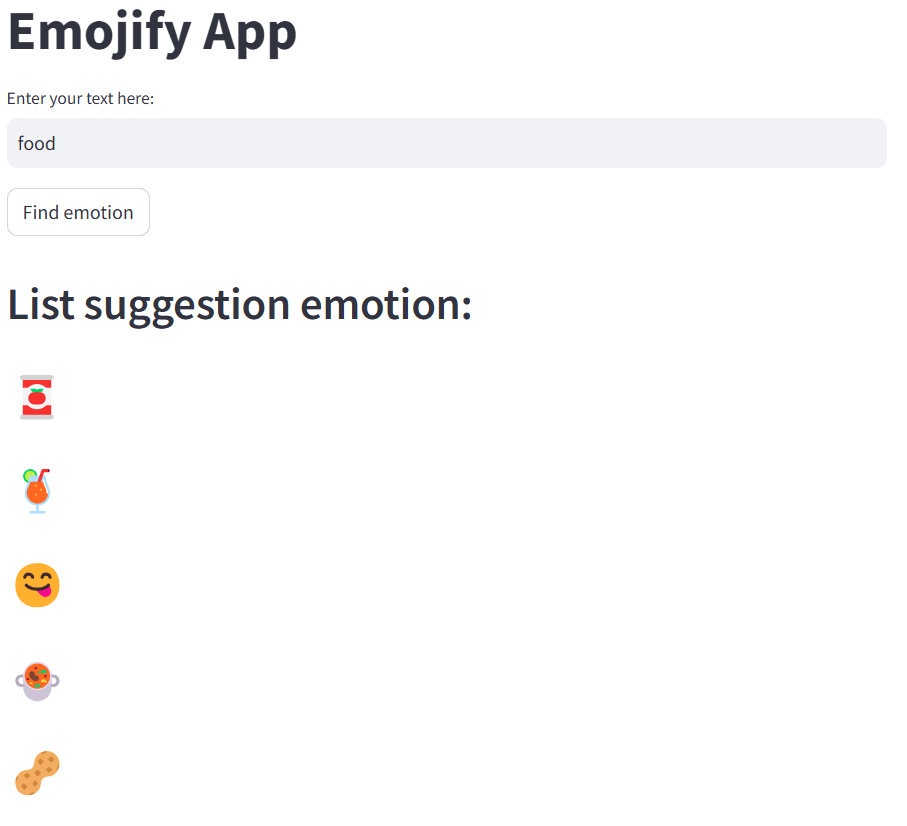

# Emoji Search app

## Table of Contents
- [Overview](#overview)
- [Data Augmentation](#data-augmentation)
- [Training](#training)
- [Deployment](#deployment)
- [Getting Started](#getting-started)
- [Acknowledgements](#acknowledgements)

## Overview

The Emojify App uses machine learning to predict the most relevant emoji based on a user's input text, including both English and Vietnamese language.

## Data Augmentation

To enhance the model’s performance to varied text inputs, we applied several data augmentation techniques to expand our original dataset:

- **Original Dataset Size**: 708 samples
- **Augmented Dataset Size**: 6076 samples

### Augmentation Techniques
1. **Synonym Replacement (WordNet Corpus)**: Replaces words with synonyms using WordNet. For example:
   - **Input**: "I like pizza"
   - **Augmented**: "I love pizza"
  
2. **Similar GloVe Embedding Replacement**: Replaces words with semantically similar words using GloVe embeddings to capture contextual similarity.
   - **Input**: "The day is sunny"
   - **Augmented**: "The day is bright"

3. **Word Swap**: Randomly swaps positions of words within a sentence to generate syntactic variations.
   - **Input**: "Red flower"
   - **Augmented**: "Flower red"

## Training

The **Emojify App** uses an **XGBoost model** trained on the augmented dataset.

- **Accuracy**: 85%
- **Top-10 Accuracy**: 94%
- **Prediction Time (Inference)**: 0.3 ms (on standard CPU)

The XGBoost provides a lightweight model that does not require a GPU, making it ideal for fast, scalable deployment in production environments.

## Deployment

The Emojify App is deployed on **DigitalOcean** using Docker to ensure a consistent, isolated environment with no library conflicts. Here’s a breakdown of the deployment setup:

- Backend **Flask**: A lightweight Python web framework used to handle API requests and model inference.

- Frontend **Streamlit**: A Python-based framework used to create an interactive web interface for users.

## Acknowledgements

- **NLTK WordNet** for synonym-based augmentation.
- **GloVe Embeddings** for contextual similarity in data augmentation.
- **XGBoost** for fast, efficient model training.
- **Flask** and **Streamlit** for an accessible and interactive web experience.
